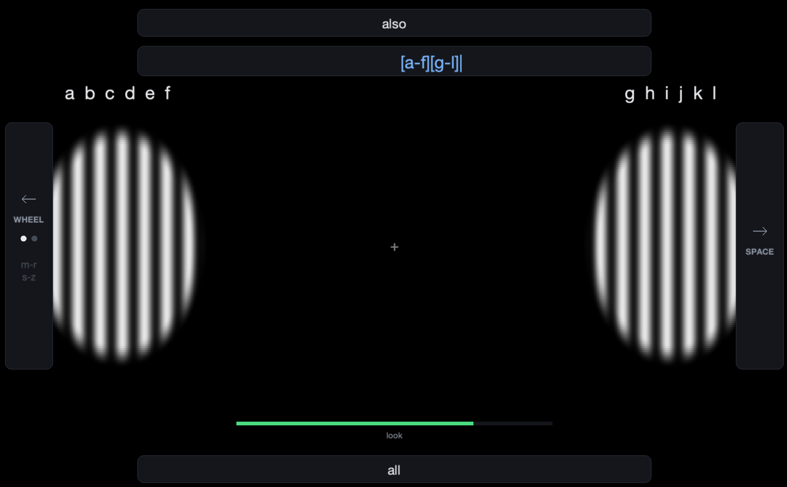

# Neuro North



Neuro North is a local [SSVEP](https://en.wikipedia.org/wiki/Steady_state_visually_evoked_potential) communication speller for the [NeuroPawn Knight EEG
board](https://www.neuropawn.tech/imu-knight-board/). It combines real-time CCA or TRCA classification with a probabilistic
word decoder, local GPT-2 scoring, and sentence-level beam search. The same
speller can run without a headset using keyboard and mouse input.

> **Photosensitivity warning:** headset collection and live EEG modes display
> flashing visual stimuli

Check out our [Devpost page](https://hackthenorth2026.devpost.com/)!

## Setup

Create one environment for the desktop app and language model:

```sh
python -m venv .venv
pip install \
  -r ssvep_training/requirements.txt \
  -r linguistic_model/experiments/requirements.txt \
  -r agent/requirements.txt
source .venv/bin/activate
```

Download GPT-2 once for offline use:

```sh
python -m linguistic_model.prepare
```

For headset use, create `.env` in the repository root:

```dotenv
PORT_PATH=/dev/cu.usbserial-XXXX
```

`--port` can override this value for an individual command.

## Run with the headset

Use the project launcher:

```sh
./run_speller.sh
```

The launcher enables the action agent by default. It dry-runs OpenAI/Composio
account tool calls unless you add `--agent-live`.

CCA requires no training session. By default, GPT-2 requires a matching
validation session to estimate range uncertainty for the selected channels:

```sh
python -m ssvep_training.speller_ui \
  --channels 1,2,3,4 \
  --decoder cca \
  --engine gpt2 \
  --save \
  --imu-debug
```

Add `--windowed` for windowed mode. Add `--manual` to press Space before each
EEG selection, or `--no-imu` to use arrow keys instead of head gestures.

To treat every accepted CCA/TRCA argmax as certain, add:

```sh
--range-evidence hard
```

Hard evidence sends the selected range as `1.0` and the other displayed range
as `0.0`. It does not require a validation session, but sentence beam cannot
recover from an accepted SSVEP range error. The default is
`--range-evidence calibrated`.

For TRCA, provide the frozen calibration and matching validation sessions:

```sh
python -m ssvep_training.speller_ui \
  --channels 1,2,3,4 \
  --decoder trca \
  --session ssvep_training/training_data/session_TIMESTAMP \
  --evidence-session ssvep_training/training_data/validation_TIMESTAMP \
  --trca-min-peak 0.10 \
  --engine gpt2 \
  --save
```

`run_speller.sh` contains the current project-specific TRCA session and
validation paths. Update those paths when selecting a new frozen model.

## Agent actions

The agent turns finished speller text into OpenAI tool calls, then uses
Composio to create Google Calendar events and Gmail drafts. Browser actions run
locally against the cloud browser session; account actions dry-run unless live
mode is enabled.

For live Google Calendar and Gmail actions, set:

```dotenv
OPENAI_API_KEY=...
COMPOSIO_API_KEY=...
```

Authorize Composio once:

```sh
python -m agent.connect
python -m agent.connect --toolkit gmail
```

Run a dry command directly:

```sh
python -m agent.runner "dentist appointment tomorrow 3pm"
```

Create real calendar events or Gmail drafts:

```sh
python -m agent.runner "email aaron saying running late" --live
```

Local contacts are stored in `agent/contacts.json` so demo names such as
`aaron` can resolve instantly before falling back to Gmail contact search.

## Calibration and validation

Record labelled SSVEP trials:

```sh
python -m ssvep_training.collect_training_data \
  --channels 1,2,3,4 \
  --blocks 8
```

Run prospective CCA validation with idle controls:

```sh
python -m ssvep_training.validate_live \
  --channels 1,2,3,4 \
  --decoder cca \
  --blocks 10 \
  --idle-trials 4
```

Validate a frozen TRCA session:

```sh
python -m ssvep_training.validate_live \
  --channels 1,2,3,4 \
  --decoder trca \
  --session ssvep_training/training_data/session_TIMESTAMP \
  --blocks 10 \
  --idle-trials 4
```

Audit saved recordings without connecting the headset:

```sh
python -m ssvep_training.audit
python -m ssvep_training.audit --session ssvep_training/training_data/session_TIMESTAMP
```

## IMU gesture setup

Learn gesture directions for the headset's current mounting:

```sh
python -m ssvep_training.imu_setup --channels 1,2,3,4
```

Check an existing profile without replacing it:

```sh
python -m ssvep_training.imu_setup --channels 1,2,3,4 --check
```

## Run without a headset

Use the launcher:

```sh
./run_speller.sh --simulate --windowed
```

Or run the module directly:

```sh
python -m ssvep_training.speller_ui \
  --keys \
  --engine gpt2
```

Use `--engine bigram` for the lightweight model or `--windowed` for
windowed mode. The launcher uses `.venv/bin/python` by default; set `PYTHON` to
use another environment, for example `PYTHON=python3 ./run_speller.sh --simulate`.

### Keyboard and mouse controls

| Input | Action |
|---|---|
| `1` / click left box | Select the left range |
| `2` / click right box | Select the right range |
| Left arrow / left panel | Change range page |
| Right arrow / right panel | End a word; with no pending ranges, commit the sentence |
| Right action again / Return | Send the committed message to the agent |
| Up arrow / top panel | Accept the top suggestion |
| Down arrow / bottom panel | Accept the bottom suggestion |
| Escape | Quit |

Blue words are tentative Sentence-beam output. Later words may revise them.
Use the right action again with no pending ranges to commit the sentence.

## Repository layout

```text
ssvep_training/   acquisition, stimuli, CCA/TRCA, IMU, desktop speller
linguistic_model/ probabilistic decoder, GPT scorer, beam search, web simulator
agent/            OpenAI tool loop, Composio action mappings, browser control
stream.py         Knight board configuration and signal utilities
run_speller.sh    project-specific desktop launcher
```

Recordings and generated results stay local under
`ssvep_training/training_data/` and `ssvep_training/results/`; both are ignored
by Git.
