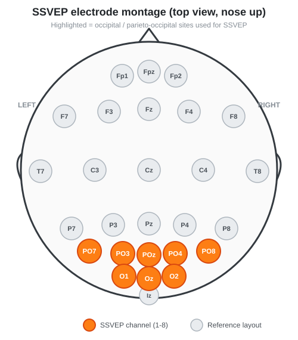

# NeuroPawn SSVEP-TRCA Tutorial

A complete, hackable **brain–computer interface (BCI)** that reads your EEG
from a [NeuroPawn Knight board](https://www.neuropawn.tech/), figures out which
flickering square you are looking at, and turns that into a keyboard press. It
uses **SSVEP** (steady-state visually evoked potentials) as the brain signal
and **TRCA** (task-related component analysis) as the classifier.

This repo is written as a **tutorial**: every module is small, commented, and
does one thing. By the end you will be able to collect your own training data
and drive a game or robot with your eyes.

---

## Table of contents

1. [What is SSVEP and why does it work?](#1-what-is-ssvep-and-why-does-it-work)
2. [Where to place the electrodes](#2-where-to-place-the-electrodes)
3. [Setting up the Knight board (the commands matter!)](#3-setting-up-the-knight-board-the-commands-matter)
4. [Reading data without draining the buffer](#4-reading-data-without-draining-the-buffer)
5. [Timing is everything (and how I validated it)](#5-timing-is-everything-and-how-i-validated-it)
6. [Pre-processing](#6-pre-processing)
7. [How TRCA classifies SSVEP](#7-how-trca-classifies-ssvep)
8. [Why the order you look at the stimuli matters](#8-why-the-order-you-look-at-the-stimuli-matters)
9. [Project layout](#9-project-layout)
10. [Quick start](#10-quick-start)

---

## 1. What is SSVEP and why does it work?

When you stare at a light that flickers at a fixed frequency **f**, the neurons
in your **primary visual cortex (V1)**, at the back of your head in the
**occipital lobe**, start firing in lockstep with that flicker. This is called
**neural entrainment**: large populations of neurons synchronise their activity
to the rhythm of the external stimulus. The result is a periodic voltage
oscillation on the scalp at **f** and its harmonics (2f, 3f, …) that we can pick
up with EEG electrodes.

So if four squares flicker at 6.67, 8.57, 10, and 12 Hz and you look at the
10 Hz square, your occipital EEG develops a clear peak at 10 Hz (and 20 Hz,
30 Hz…). The BCI just has to answer: *which flicker frequency is dominant in
the EEG right now?* That is a remarkably robust question to ask of the brain,
which is why SSVEP BCIs are fast and need almost no user training.

Key properties we exploit:

- **The response is strongest over the occipital cortex** → electrode placement
  matters (Section 2).
- **The response has a short latency** (~120–150 ms) before the cortex "locks
  on" → we ignore the first 150 ms of each window (Section 5).
- **The response is stereotyped and repeatable for a given person** → we can
  learn a personalised spatial filter with TRCA (Section 7).

---

## 2. Where to place the electrodes

SSVEP is generated in the visual cortex, so **every electrode goes over the
occipital / parieto-occipital scalp** (the 10-20 system positions listed below).
Placing electrodes anywhere else just adds noise.

<p align="center">
  
</p>

The **orange** sites are the eight channels you wire up for SSVEP; the grey
sites are only drawn for orientation. All eight sit low and central on the back
of the head, straddling the midline over the visual cortex.

Recommended 8-channel montage (matches `ssvep/config.py → ELECTRODE_LABELS`):

| Board channel | Electrode | Location                         |
|:-------------:|:---------:|----------------------------------|
| 1             | **Oz**    | Midline occipital (strongest)    |
| 2             | **O1**    | Left occipital                   |
| 3             | **O2**    | Right occipital                  |
| 4             | **PO7**   | Left parieto-occipital           |
| 5             | **PO8**   | Right parieto-occipital          |
| 6             | **PO3**   | Left parieto-occipital (medial)  |
| 7             | **PO4**   | Right parieto-occipital (medial) |
| 8             | **POz**   | Midline parieto-occipital        |

**Reference and ground**: put the reference on one earlobe/mastoid (A1) and the
ground/bias on the other (A2). Part the hair, use conductive gel, and keep
impedances low — SSVEP is small (microvolts) and buried under mains hum.

> **Reference diagrams.** For the full standardised layout see Wikipedia's
> [21-electrode 10-20 map](https://en.wikipedia.org/wiki/File:21_electrodes_of_International_10-20_system_for_EEG.svg)
> and the higher-density
> [10-10 system map](https://en.wikipedia.org/wiki/File:EEG_10-10_system_with_additional_information.svg)
> (which includes the PO row). Our montage is the posterior subset of those.

---

## 3. Setting up the Knight board (the commands matter!)

When BrainFlow first connects to the Knight board, **every EEG channel is
powered down**. If you start streaming right away you get flat lines. Each
channel must be:

1. **Turned on** with a gain, via `chon_{channel}_{gain}` — this powers the
   channel's amplifier at the given PGA gain (we use 12).
2. **Added to the bias / right-leg-drive (RLD) loop** with `rldadd_{channel}` —
   this feeds an inverted common-mode signal back into the body to actively
   cancel mains hum and movement artifacts. It is the single biggest factor in
   getting clean SSVEP.

`ssvep/board.py` sends these two commands for every channel, with short sleeps
in between because the firmware needs a moment to apply each register write:

```python
board.prepare_session()
board.start_stream(450000)
time.sleep(2)
for ch in range(1, num_channels + 1):
    board.config_board(f"chon_{ch}_12")   # power channel ON at gain 12
    board.config_board(f"rldadd_{ch}")    # add channel to bias/RLD loop
```

> ⚠️ Configuring all 8 channels takes **~25–30 seconds**. Both scripts wait
> ~30 s after starting the board before the first trial — this is why. Do not
> skip it; without `chon`/`rldadd` you are recording noise.

---

## 4. Reading data without draining the buffer

BrainFlow stores incoming samples in a fixed-size **ring buffer**. There are two
ways to read it, and the difference is important:

| Method | Behaviour |
|--------|-----------|
| `get_board_data()` | Returns **everything** and **empties** the buffer (destructive). |
| `get_current_board_data(n)` | Returns a **copy** of the latest `n` samples and **leaves the buffer intact** (non-destructive). |

We always use `get_current_board_data(188)` (wrapped as `KnightBoard.get_latest`).
Because it is non-destructive:

- The board keeps filling the ring buffer continuously in the background.
- After each flicker period we simply **peek** at the most recent 188 samples
  (~1.5 s at 125 Hz) — the exact window the user was just staring at.
- Nothing has to coordinate "who owns the buffer"; the stimulus process and the
  classifier never fight over it, and no samples are ever lost.

This is what lets the PsychoPy stimulus loop and the background acquisition
process run independently and still stay perfectly aligned.

---

## 5. Timing is everything (and how I validated it)

SSVEP classification lives and dies by timing. Two things must be exact:

**(a) The flicker itself must be frame-accurate.** Each square is set white or
black once per monitor refresh according to the sign of a sine wave:

```python
colour = white if sin(2*pi*f*t) >= 0 else black   # updated every win.flip()
```

On a **60 Hz** monitor the chosen frequencies land on near-integer frame
counts (6.67 Hz ≈ 9 frames, 8.57 Hz ≈ 7, 10 Hz = 6, 12 Hz = 5), so the flicker
stays rock-steady. If the monitor drops frames, the real flicker frequency
drifts away from the intended one and accuracy collapses.

**(b) The EEG window must line up with the flicker.** The trial structure is:

```
|<-- 1.0 s cue -->|<----- 1.5 s flicker ----->| capture + 0.5 s rest |
     look here            eyes on target        grab last 188 samples
```

At the end of the 1.5 s flicker the recording flag is raised, and the child
process grabs the last **188 samples**. TRCA then uses samples **[19 : 144]** —
i.e. it **throws away the first ~150 ms** (visual latency, before the cortex
entrains) and keeps a clean **1.0 s** window.

### Validating the flicker with an Arduino + photoresistor

You should never *assume* your monitor flickers at the frequency you asked for —
software timers, v-sync and frame drops all lie. So I measured it directly.

I taped a **photoresistor (LDR)** to the surface of a flickering square and read
it with an Arduino (`utils/freq-checker/freq-checker.ino`). The sketch:

1. Reads the LDR voltage on `A0` as fast as it can.
2. Uses a **threshold with hysteresis** to convert the analog brightness into a
   clean square wave (so noise near the threshold doesn't cause false edges).
3. Times the interval between rising edges (dark → light) with `micros()` and
   converts it to Hz, smoothed with an exponential moving average.

```cpp
// rising edge → one flicker period elapsed
float hz = 1000000.0f / (float)dt;   // dt in microseconds
```

Watching the reported Hz match the intended frequencies (within a fraction of a
Hz) is the proof that the *photons hitting your retina* really are flickering at
6.67 / 8.57 / 10 / 12 Hz — not just the numbers in the code. If they don't
match, fix the display (refresh rate, v-sync, GPU) **before** trusting any EEG.

---

## 6. Pre-processing

The **exact same** filter chain is applied when recording training data and when
classifying live data — otherwise the learned spatial filters no longer match
the incoming signal. It lives in one place: `ssvep/preprocessing.py`.

Per channel, in order:

1. **Detrend (constant)** — remove the DC offset / slow baseline.
2. **Band-pass 3–48 Hz** (2nd-order Butterworth, zero-phase) — keep the SSVEP
   fundamentals and their first harmonics; drop drift and muscle noise.
3. **Band-stop 49–51 Hz and 59–61 Hz** (4th-order, zero-phase) — notch out
   mains hum. Keeping both notches means the same code works on 50 Hz and 60 Hz
   power grids.

All filters are **zero-phase** (forward–backward) so they don't shift the timing
of the response, which matters because our analysis window is only 1 s long.

---

## 7. How TRCA classifies SSVEP

**TRCA (Task-Related Component Analysis)** learns, for each target frequency, a
**spatial filter** — a set of weights that combines your 8 electrodes into a
single channel that *maximises the reproducibility* of the SSVEP response across
your training trials. Intuitively: it finds the electrode mixture where "the
part of the signal that repeats every time you look at 10 Hz" is strongest and
the random noise cancels out.

The pipeline (`ssvep/trca_model.py`, built on
[`meegkit`](https://github.com/nbara/python-meegkit)):

1. **Filter bank.** The signal is split into 6 overlapping sub-bands
   (`config.FILTERBANK`) so the classifier can exploit SSVEP *harmonics*, not
   just the fundamental. Higher sub-bands carry the 2nd/3rd harmonics.
2. **Fit.** For each target, TRCA computes a spatial filter and an averaged
   template from your training trials.
3. **Predict.** A new 1 s window is filtered through every sub-band and every
   target's spatial filter, correlated with that target's template, and the
   sub-band correlations are combined. The **target with the highest score
   wins.** We use the **ensemble** variant, which shares information across all
   targets' filters and is noticeably more accurate.

To know how good your model actually is, `evaluate_trca.py` runs
**leave-one-block-out cross-validation** and reports accuracy plus **ITR**
(information transfer rate, bits/min — the standard BCI speed metric).

---

## 8. Why the order you look at the stimuli matters

TRCA is a **supervised, personalised** method: it only knows what a "10 Hz
response" looks like because you *told* it, by looking at the 10 Hz target when
the software recorded a trial labelled 10 Hz. Two consequences:

- **Labels must be correct.** During collection you are cued which square to
  look at, and the captured window is saved under that target's label
  (`block_{block}_{trial}.csv`, where `trial` encodes the target). If you look
  at the wrong square, that trial is mislabelled and poisons the model.

- **Your training data must reflect the real world.** The classifier will only
  generalise to conditions it has seen. If you train sitting perfectly still in
  a dark room but then *use* the BCI in bright light while moving, the live EEG
  won't match the templates and accuracy drops. So collect data **the same way
  you'll use it**: same electrode placement, posture, lighting, distance to
  screen, and roughly the same gaze-shift rhythm.

  This repo also **randomises the order** the targets are cued within each block.
  If you always looked at them in the same fixed order (top-left, top-right, …),
  the model could accidentally learn *sequence/adaptation artifacts* (e.g. eye
  fatigue, expectation) that correlate with the label but have nothing to do
  with the flicker. Randomising the order — while still recording several blocks
  so every target appears many times — breaks that confound and gives you a
  filter that responds to the *frequency*, not the *order*.

---

## 9. Project layout

```
ssvep/                     # the reusable, commented library
├── config.py              # all tunable parameters (port, freqs, timing, keys)
├── board.py               # KnightBoard: connect, configure channels, read buffer
├── preprocessing.py       # shared detrend + band-pass + notch filter chain
├── trca_model.py          # load data, fit TRCA, cross-validate, predict
├── recording.py           # background board-reader process (collect / predict)
└── stimulus.py            # PsychoPy window, flicker squares, single-trial routine

collect_training_data.py   # SCRIPT 1: record your own labelled SSVEP blocks
realtime_control.py        # SCRIPT 2: live TRCA control mapped to keyboard keys
evaluate_trca.py           # offline leave-one-block-out cross-validation
check_analysis.py          # no-hardware check: filter -> crop -> TRCA -> predict
trca4stim.ipynb            # notebook: visualise harmonics + walk through TRCA

docs/electrode_montage.svg # the electrode diagram shown above
utils/freq-checker/        # Arduino sketch to validate flicker timing (LDR)
training_data/             # your recorded block_{block}_{trial}.csv files (git-ignored)
training_data_synthetic/   # throwaway blocks from `--synthetic` runs (git-ignored)
legacy/                    # the original scripts, archived (git-ignored)
```

> The original PsychoPy-Builder scripts (`SSVEP_FIXED.py`,
> `SSVEP_FIXED_RECORDER.py`, `trca_psychopy.py`, `main.py`, the old
> `knight_board_init.py` and the `utils/` helper scripts) now live in
> `legacy/`. They are kept for reference but are **superseded** by the
> consolidated `ssvep/` package and the scripts above.

---

## 10. Quick start

### Install

**Use Python 3.11 or 3.12** — psychopy publishes no wheels for 3.13+.

```bash
# macOS       brew install python@3.12
# Windows     install 3.12 from python.org
# Linux       apt/dnf install python3.12  (Arch: uv python install 3.12)

python3.12 -m venv venv          # Windows: py -3.12 -m venv venv
source venv/bin/activate         # Windows: venv\Scripts\activate
python -m pip install -r requirements.txt
```

Always `python -m pip`, never bare `pip` — on Linux a bare `pip` can escape the
venv and hit your distro's "externally-managed-environment" block.

Keystrokes are a **bonus, not a requirement**. The speller draws the letters it
decodes onto the stimulus screen itself, so it runs fine with no keyboard
backend at all. When one is available (`pydirectinput` on Windows, `pyautogui`
on macOS/Linux) the same letter is also typed into whatever window has focus.

> **Wayland note:** compositors like Hyprland start Xwayland with no auth file,
> so `pyautogui` fails with `XauthError: ~/.Xauthority` even though XWayland is
> running and PsychoPy renders fine. The speller prints a warning and carries
> on. If you want it to type into *other* apps too, `touch ~/.Xauthority`.

### Configure

Open `ssvep/config.py` and set at least:

- `BOARD_VARIANT` — `"imu"` for the Knight board **with** the motion sensor
  (BrainFlow `NEUROPAWN_KNIGHT_BOARD_IMU`, 22 data rows) or `"plain"` for the
  one without (`NEUROPAWN_KNIGHT_BOARD`, 13 rows). Both stream the same 8 EEG
  channels at 125 Hz, but BrainFlow parses the serial packets differently, so
  the wrong choice gives you flat lines or garbage rather than an error.
  Default is `"imu"`.
- `SERIAL_PORT` — your board's COM port (Windows) or `/dev/tty…` (Linux/macOS).
- `STIMULUS_SCREEN` — `0` for your main monitor, `1` for a second monitor.
- `KEY_MAP` — which key each target should press.

`BOARD_VARIANT` and `SERIAL_PORT` can also be overridden per-run without
editing the file:

```bash
SSVEP_SERIAL_PORT=/dev/ttyUSB0 SSVEP_BOARD_VARIANT=plain python collect_training_data.py
```

Make sure the stimulus monitor runs at **60 Hz**.

### No headset yet? Run it anyway

```bash
python collect_training_data.py --no-board    # flicker only, nothing recorded
python collect_training_data.py --synthetic   # full capture loop on a fake board
python realtime_control.py --synthetic        # full predict loop on a fake board
                                              # (Wayland: needs ~/.Xauthority, see below)
```

`--no-board` shows the stimulus and skips the board entirely — this is the mode
to demo the setup to people. `--synthetic` swaps the Knight board for
BrainFlow's synthetic one, so the whole record → filter → TRCA → predict → keypress
chain runs with nothing plugged in. Its "predictions" are noise; it proves the
plumbing, not the science. Synthetic blocks stream at 250 Hz, so they are kept
in `training_data_synthetic/` and never mixed into a real training set.

The `realtime_control.py` line is the only one that emulates keystrokes, so it
is the only one that needs a working X11 keyboard backend. On Wayland it aborts
with `XauthError` until you `touch ~/.Xauthority` (see the Install section) —
the other two commands never touch pyautogui and work regardless.

Three self-checks run without hardware **or** a display:

```bash
python -m ssvep.board      # board wrapper + a real synthetic stream
python ssvep/stimulus.py   # FFT of the frame pattern: each target hits its Hz
python check_analysis.py   # filter -> crop -> TRCA fit -> predict, at 125 and 250 Hz
```

### 1) Collect training data

```bash
python collect_training_data.py
```

Look **only** at the cued (red-outlined) square each trial and hold your gaze
steady during the flash. Do 6+ blocks. Files land in `training_data/`.

### 2) Check your model (optional but recommended)

```bash
python evaluate_trca.py                 # defaults to training_data/
python evaluate_trca.py --data-dir training_data_synthetic
```

Aim for high per-block accuracy. If it's poor: check electrode contact, redo the
board setup, confirm the monitor is a true 60 Hz, and collect more blocks.

### 3) Spell in real time

```bash
python realtime_control.py
```

Look at a square for ~1.5 s. The letter it stands for is appended to a string
drawn in the middle of the screen, so you watch the word build up as you type
it. `KEY_MAP` in `ssvep/config.py` decides which letter each square means —
it defaults to `a b c d`. Press **Escape** to stop.

The stimulus window is fullscreen and therefore holds keyboard focus, so it
would swallow any keystroke aimed at another app — which is exactly why the
string is drawn here instead. To drive a game or a teleop window instead of
spelling, set `FULLSCREEN = False`, point `KEY_MAP` at `w s a d`, and give the
target app focus.

---

*Built for the NeuroPawn Knight board. SSVEP + ensemble TRCA. Have fun, and
mind your electrode impedances.*
